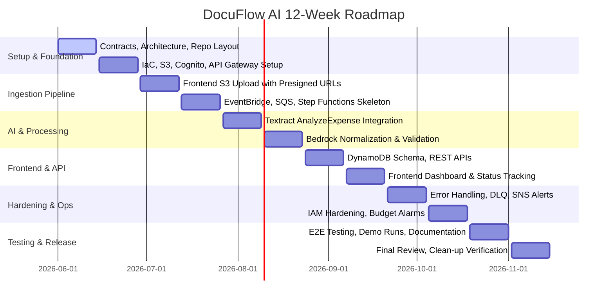

In this section, we present the high-level proposal and detailed technical blueprint for **DocuFlow AI**, a serverless, intelligent invoice and receipt processing platform on AWS.

---

# DocuFlow AI
## Serverless Intelligent Invoice & Receipt Processing Platform on AWS
**Version:** AeroOps Team v1.0  
**Last Updated:** June 24, 2026  
**Target Audience:** AeroOps Team members, mentors, and reviewers.

---

## 1. Executive Summary
**DocuFlow AI** is a fully serverless, event-driven intelligent document processing platform designed to automate the extraction, normalization, and validation of financial invoices and receipts. By combining **AWS IoT/S3 event-driven triggers**, **AWS Step Functions orchestrations**, **Amazon Textract** for OCR/expense analysis, and **Amazon Bedrock (LLMs)** for schema normalization, the platform eliminates manual data entry, reduces processing errors, and provides real-time tracking of invoice statuses. Secure user authentication is managed via **Amazon Cognito**, and a web interface hosted on **AWS Amplify/CloudFront** offers intuitive document uploads, status monitoring, and data verification.

---

## 2. Problem Statement & Solution

### The Business Problem
Currently, organizations handle high volumes of invoices and receipts through manual data entry. This introduces several challenges:
* **High Operational Overhead & Errors:** Manual typing of vendor names, dates, amounts, taxes, and currencies is slow and prone to errors.
* **Document Scattering:** Files reside in disparate locations (emails, local folders, chat apps), making searching and compliance auditing difficult.
* **Lack of Visibility:** No centralized system exists to track whether a document was received, successfully processed, flag validation failures, or identify documents requiring human review.
* **Lack of Spending Insights:** The organization lacks structured data to analyze spending patterns, monthly summaries, or vendor breakdown.
* **Security & Compliance Risks:** Sensitive financial data is stored in unencrypted folders without structured user access controls or audit logs.

### The DocuFlow AI Solution
DocuFlow AI solves these problems by providing an automated, secure pipeline:
1. **Automated Ingestion:** Users log in securely and upload files directly to an Amazon S3 raw bucket using short-lived presigned URLs.
2. **Event-Driven AI Orchestration:** S3 upload triggers an EventBridge rule that directs requests through an SQS queue to start an AWS Step Functions workflow.
3. **Multi-Stage Extraction & Normalization:** Textract extracts raw expense data, and Amazon Bedrock formats and normalizes it into a predefined JSON schema.
4. **Validation & Monitoring:** Lambda functions validate the data and calculate confidence scores. Documents with high confidence are stored as `EXTRACTED`; others are marked as `REVIEW_REQUIRED` and trigger alert notifications via Amazon SNS.
5. **Centralized Dashboard:** A static web application provides users with real-time status updates and extracted metadata.

### Business Value & ROI
* **Efficiency Gains:** Reduces document ingestion and data-entry time by over 90% (processing completed in less than 60 seconds).
* **Cost Efficiency:** A serverless pay-per-use architecture ensures that costs scale with volume. Operational infrastructure costs are estimated at just **$0.70/month** for a demo volume of 5-10 daily documents.
* **Data-Driven Insights:** Provides clean, structured JSON data that can be queried using Amazon Athena or visualized on Amazon QuickSight.

---

## 3. Solution Architecture
The architecture is designed to be fully serverless, highly decoupled, and secure. It spans five major layers: Frontend/Auth, Ingestion & API, Workflow Processing, Data Storage/Persistence, and Observability/Security.


### AWS Services Mapping
* **Frontend & Authentication:** 
  * **Amazon S3 & Amazon CloudFront:** Host static frontend assets securely.
  * **Amazon Cognito:** Manages user authentication (sign-up/sign-in) and issues JWT tokens.
  * **AWS WAF:** Protects the API Gateway and CloudFront distribution.
* **API & Ingestion:**
  * **Amazon API Gateway:** Exposes RESTful endpoints for getting presigned URLs, listing documents, and retrieving extraction details.
  * **AWS Lambda (Presigned URL):** Generates short-lived upload URLs for S3.
  * **Amazon S3 (Raw Bucket):** Stores uploaded raw documents (PDF, JPG, PNG).
* **Workflow Processing:**
  * **Amazon EventBridge:** Routes S3 object creation events to SQS.
  * **Amazon SQS & DLQ:** Decouples file upload from processing and acts as a buffer to handle high traffic and isolate failed jobs.
  * **AWS Lambda (Job Starter):** Starts Step Functions executions from SQS messages.
  * **AWS Step Functions:** Orchestrates the validation, Textract OCR analysis, Bedrock model invocation, JSON schema normalization, validation check, and storage.
* **AI & Machine Learning:**
  * **Amazon Textract (AnalyzeExpense):** Extracted key-value pairs and raw tabular data from invoices/receipts.
  * **Amazon Bedrock:** Normailizes raw extracted fields into a strict schema, translates languages, classifies document type, and handles reasoning.
* **Data Storage & Persistence:**
  * **Amazon DynamoDB:** Stores document metadata, status flags, validation errors, and summary data.
  * **Amazon S3 (Processed Bucket):** Stores the normalized JSON artifacts for analysis.
* **Observability & Operations:**
  * **Amazon CloudWatch:** Logs all execution steps, raises alarms, and aggregates operational metrics.
  * **Amazon SNS / SES:** Sends notifications and email alerts on system failures or low-confidence extractions.
  * **AWS CDK / SAM:** Standardizes infrastructure deployment as code.

---

## 4. Technical Implementation & Timeline

### Implementation Phases
* **Phase 1 (Weeks 1-2): Foundation & IaC:** Define data contracts, repository layout, initial SAM/CDK templates, and set up basic S3, Cognito, and API Gateway resources.
* **Phase 2 (Weeks 3-4): Ingestion Pipeline:** Implement frontend uploads using S3 presigned URLs, EventBridge event routing, SQS queuing, and Step Functions skeleton.
* **Phase 3 (Weeks 5-6): AI Extraction & Normalization:** Integrate Textract AnalyzeExpense and write lambda orchestrations for Bedrock to normalize the JSON.
* **Phase 4 (Weeks 7-8): Database & Frontend Integration:** Set up DynamoDB metadata storage, write backend APIs, and connect the frontend dashboard.
* **Phase 5 (Weeks 9-10): Security, Alerts & Operations:** Hardening IAM roles, setting up CloudWatch Alarms, SNS alerts, and implementing budget thresholds.
* **Phase 6 (Weeks 11-12): Testing, Demo & Clean-up:** Perform end-to-end testing, record demo scenarios, and verify the clean-up automation.

### Project Timeline (12-Week Roadmap)


---

## 5. Budget Estimation & Cost Control
We prioritize keeping the architecture highly cost-effective and demo-friendly.

### Infrastructure Cost Breakdown (For 300 documents processed/month)
* **AWS Lambda:** $0.00/month (Falls entirely within the free tier).
* **Amazon S3 (Standard Storage & Requests):** ~$0.15/month (based on storing ~6 GB of raw files and processed JSON).
* **AWS Amplify (Hosting & Builds):** ~$0.35/month.
* **Amazon API Gateway:** ~$0.01/month (based on 2,000 requests/month).
* **AWS Glue ETL & Crawlers (Optional):** ~$0.09/month.
* **Amazon Textract (AnalyzeExpense):** ~$0.08/month.
* **Amazon Bedrock (Claude 3 Haiku / small model):** ~$0.02/month.
* **Data Transfer & SNS Alerts:** ~$0.02/month.

**Estimated Total Monthly Cost:** **~$0.70 USD** (excluding hardware/personal computer expenses).

### Cost Control Policies
* **AWS Budgets:** Set up budget alerts at **$5.00** and **$10.00** limit.
* **File Processing Limits:** Enforce maximum file size of **5 MB** and maximum page count of **3 pages** per document in the validation layer to avoid massive Textract/Bedrock usage billing.
* **Lifecycle Rules:** Configure S3 raw and processed buckets to expire data after 14 days to keep storage footprints minimal.

---

## 6. Risk Assessment & Mitigation

| Identified Risk | Impact | Probability | Mitigation Strategy |
| :--- | :--- | :--- | :--- |
| **Model Hallucination / Bedrock Output Errors** | Medium | Medium | Implement validation schema inside Lambda after Bedrock invocation. If validation fails, set status to `FAILED` or `REVIEW_REQUIRED`. |
| **Poor OCR Quality (Blurry / Hand-written files)** | High | Medium | Use a confidence threshold policy. If Textract returns a low confidence score, flag the file as `REVIEW_REQUIRED` for human verification. |
| **Bedrock Service Availability in Target Region** | High | Low | Confirm Bedrock is active in the deployed region (e.g., `us-east-1` or `ap-southeast-1`). Establish fallback models or enable cross-region calls. |
| **Credential/Secret Leaks** | Critical | Low | Enforce IAM policies that avoid wildcards. Never check credentials, environment configurations, or sample invoices with personal data into Git. |

---

## 7. Expected Outcomes
* **Unified Pipeline:** A fully automated serverless pipeline that turns unstructured PDF/JPG invoices into structured JSON metadata.
* **High Extraction Accuracy:** Achieving **>= 90%** extraction accuracy on core financial summary fields (vendorName, invoiceDate, totalAmount, taxAmount, currency).
* **Operational Readiness:** Fully documented, easily deployable via IaC, and easily cleanable using a clean-up script to prevent unintended AWS charges.

---

# Appendix: Detailed Implementation Blueprint
The following sections detail the strict contracts, data shapes, and policies that team members must follow to ensure parallel development without integration issues.

## A. Detailed Scope & Success Criteria

### MVP Requirements
* **User Auth:** Amazon Cognito login/registration.
* **Direct S3 Ingest:** File upload to S3 raw bucket via short-lived presigned URL.
* **Decoupled Queue:** EventBridge -> SQS (+DLQ) -> Lambda Job Starter.
* **Orchestrated Workflow:** Step Functions coordination.
* **Extraction & Parsing:** Textract AnalyzeExpense for raw data, Bedrock for normalization.
* **Metadata Persistence:** DynamoDB status entries and S3 processed JSON storing.
* **Frontend UI:** Dashboard page containing document list, upload progress, and document details.
* **Alarms & Alerts:** CloudWatch alarms for Lambda errors and SQS DLQ messages, sending SNS emails.

### Non-Goals for MVP
* Processing generic multi-page corporate PDFs (contracts, purchase orders).
* Building multi-level manual approval systems.
* Storing environment-specific passwords or keys in the repository.

---

## B. Data Contract & JSON Schemas

### Normalized Document JSON Schema
Every document processed must output a JSON file matching the schema below:

```json
{
  "documentId": "doc-001",
  "userId": "user-123",
  "fileName": "invoice-001.pdf",
  "documentType": "INVOICE",
  "status": "EXTRACTED",
  "vendorName": "ABC Company",
  "invoiceDate": "2026-06-01",
  "currency": "VND",
  "totalAmount": 2500000,
  "taxAmount": 250000,
  "confidenceScore": 0.91,
  "lineItems": [
    {
      "description": "Cloud service fee",
      "quantity": 1,
      "unitPrice": 2250000,
      "amount": 2250000
    }
  ],
  "s3RawPath": "s3://raw-bucket/user-123/doc-001.pdf",
  "s3ProcessedPath": "s3://processed-bucket/user-123/doc-001.json",
  "createdAt": "2026-06-08T10:00:00Z",
  "updatedAt": "2026-06-08T10:01:00Z",
  "errorMessage": null
}
```

### Document Status Transitions
```
UPLOADED → PROCESSING → [EXTRACTED | REVIEW_REQUIRED | FAILED]
```
* **UPLOADED:** File successfully written to S3 Raw, record created in DB.
* **PROCESSING:** Step Functions execution is running.
* **EXTRACTED:** Successful parsing, confidence score >= 0.80, and required fields are present.
* **REVIEW_REQUIRED:** Extraction finished, but some required fields are missing or overall confidence < 0.80.
* **FAILED:** Input file validation failed, size exceeded, or a runtime error occurred during Textract/Bedrock execution.

### DynamoDB Table Schema
* **Table Name:** `DocuFlowDocuments`
* **Partition Key (PK):** `documentId` (string)
* **GSI 1 Partition Key:** `userId` (string)
* **GSI 1 Sort Key:** `createdAt` (string) (Supports listing user's documents ordered by time)
* **GSI 2 Partition Key:** `status` (string)
* **GSI 2 Sort Key:** `createdAt` (string) (Supports filtering failed or review-required documents)

### S3 Object Conventions
* **S3 Raw Bucket Layout:**
  `raw/{userId}/{yyyy}/{mm}/{dd}/{documentId}/{originalFileName}`
* **S3 Processed Bucket Layout:**
  `processed/{userId}/{yyyy}/{mm}/{dd}/{documentId}/result.json`  
  `processed/{userId}/{yyyy}/{mm}/{dd}/{documentId}/textract-raw.json`  
  `processed/{userId}/{yyyy}/{mm}/{dd}/{documentId}/bedrock-normalized.json`

---

## C. API Contract

### Endpoints List
* **POST `/documents/upload-url`**
  * *Description:* Generates a presigned URL to upload a file directly to S3.
  * *Request Body:*
    ```json
    {
      "fileName": "invoice-001.pdf",
      "contentType": "application/pdf",
      "fileSize": 512000
    }
    ```
  * *Response:*
    ```json
    {
      "documentId": "doc-001",
      "uploadUrl": "https://s3-presigned-url...",
      "s3Key": "raw/user-123/2026/06/24/doc-001/invoice-001.pdf",
      "expiresIn": 300
    }
    ```
* **GET `/documents`**
  * *Description:* Retrieves a list of documents uploaded by the authenticated user.
  * *Headers:* `Authorization: Bearer <JWT Token>`
  * *Response:* Array of document metadata objects.
* **GET `/documents/{documentId}`**
  * *Description:* Retrieves the detailed extraction results and status for a specific document.
  * *Headers:* `Authorization: Bearer <JWT Token>`
  * *Response:* Full Document JSON.

---

## D. Detailed Workflow Design

### Step Functions Workflow
1. **ValidateInput:** Check file extensions (PDF, PNG, JPG) and enforce size limits (< 5MB) and pages (< 3).
2. **UpdateStatusProcessing:** Update status in DynamoDB to `PROCESSING`.
3. **RunTextractAnalyzeExpense:** Trigger Textract AnalyzeExpense OCR job.
4. **NormalizeWithBedrock:** Pass compressed raw Textract extraction payload to Amazon Bedrock.
5. **ValidateNormalizedJson:** Parse and validate the response from Bedrock against the schema.
6. **CalculateConfidence:** Compute final confidence score.
7. **Choice State:**
   * If `confidenceScore >= 0.80` AND required fields are present: Update status to `EXTRACTED`, save database record, and write processed JSON to S3.
   * If `confidenceScore < 0.80` OR missing required fields: Update status to `REVIEW_REQUIRED`, save database record, write processed JSON to S3, and trigger SNS notification.
   * On Exception/Failure: Update status to `FAILED`, record errors, and trigger critical SNS notification.

### Bedrock Prompt Guidelines
The system prompt passed to the Bedrock model must follow this instruction:
```text
You are an invoice and receipt data extraction normalizer.
Your task is to take raw OCR outputs and structure them into the requested JSON schema.
Only return valid, parsable JSON matching the following keys:
{
  "documentType": "INVOICE|RECEIPT|UNKNOWN",
  "vendorName": "string|null",
  "invoiceDate": "YYYY-MM-DD|null",
  "currency": "VND|USD|UNKNOWN",
  "totalAmount": number|null,
  "taxAmount": number|null,
  "confidenceScore": number,
  "missingFields": []
}
Do not write markdown, do not wrap in backticks, do not write explanations.
```

---

## E. Security & Least Privilege

### IAM Policies mapping
* **UploadUrlLambdaRole:**
  * Allow `s3:PutObject` to `raw-bucket/raw/${cognito-sub}/*`.
  * Allow `dynamodb:PutItem` to `DocuFlowDocuments` table.
* **JobStarterLambdaRole:**
  * Allow `sqs:ReceiveMessage`, `sqs:DeleteMessage` for the processing SQS queue.
  * Allow `states:StartExecution` on the Step Functions state machine ARN.
* **StateMachineRole:**
  * Allow `lambda:InvokeFunction` on validation and AI Lambda functions.
  * Allow `sns:Publish` on the alert topic.
  * Allow `logs:CreateLogStream`, `logs:PutLogEvents` for execution tracing.
* **ExtractionLambdaRole:**
  * Allow `s3:GetObject` on `raw-bucket/*`.
  * Allow `s3:PutObject` on `processed-bucket/*`.
  * Allow `textract:AnalyzeExpense`.
  * Allow `bedrock:InvokeModel` for model normalizations.

---

## F. Repository Structure
```
fcj-workshop-intern/
├── content/                      # Workshop documentation
├── static/images/                # Diagrams & Static Assets
├── frontend/                     # Next.js web application
├── backend/
│   ├── functions/                # Lambda handlers (upload-url, job-starter, extraction, db-save)
│   ├── state-machine/            # ASL Definition JSON
│   └── shared/                   # Shared validation utilities and schemas
├── infra/
│   ├── template.yaml             # AWS SAM template / CDK files
│   └── scripts/                  # Deploy, seed, and clean-up automation scripts
└── samples/                      # Safe mock invoices/receipts for testing
```

---

## G. Team Responsibilities & RACI Matrix

### Module Assignment
* **Member 1 (Frontend, Auth & Ingestion API):** Responsible for Cognito User Pool, Login/Upload Frontend screens, API Gateway endpoints, and Presigned URL generation.
* **Member 2 (Ingestion Queue & Step Functions):** Responsible for S3 upload events routing, SQS + DLQ buffering, Lambda Job Starter, and the Step Functions workflow.
* **Member 3 (AI Extraction & Normalization):** Responsible for Textract extraction, Bedrock normalization prompt design, and data parsing logic.
* **Member 4 (Data Storage & Analytics):** Responsible for DynamoDB schema, S3 processed layout, and setting up Glue Crawlers/Athena queries.
* **Member 5 (Observability, Security & IaC):** Responsible for SAM/CDK scripting, IAM roles configuration, CloudWatch Alarms, SNS alerts, and project clean-up scripts.

### RACI Matrix
* **R (Responsible):** The person doing the work.
* **A (Accountable):** The final decision-maker/approver.
* **C (Consulted):** Provided advice/input.
* **I (Informed):** Updated on status/decisions.

| Item / Task | Member 1 | Member 2 | Member 3 | Member 4 | Member 5 |
| :--- | :---: | :---: | :---: | :---: | :---: |
| **JSON Schemas & Data Contract** | C | C | **R** | C | **A** |
| **API Endpoints Design** | **R** | C | I | **A** | I |
| **Step Functions Workflow** | I | **R** | C | I | **A** |
| **Prompt Engineering & Validation** | I | C | **R** | C | **A** |
| **Database Design & Queries** | C | I | C | **R** | **A** |
| **Infrastructure Deployment & IAM** | C | C | C | C | **R** / **A** |

---

## H. Definition of Done (DoD)
A task is only completed ("Done") when the following checks are met:
1. **Code Quality:** Written in accordance with least-privilege permissions, with no hardcoded credentials.
2. **Review:** PR reviewed by at least one other team member.
3. **Data Integrity:** Outputs match the defined document JSON schema and adhere to the folder layouts.
4. **Error Handling:** Transient errors have retries, permanent failures write a `FAILED` state to DB, and SQS DLQ contains failed messages.
5. **Observability:** Metric logs are active, CloudWatch alarms are set, and SNS is configured.
6. **Documentation:** The project README is updated with instructions on local setup, deployment commands, test scripts, and clean-up procedures.
7. **Cost Control:** Budget alarms set to alert at $5 and $10 thresholds.