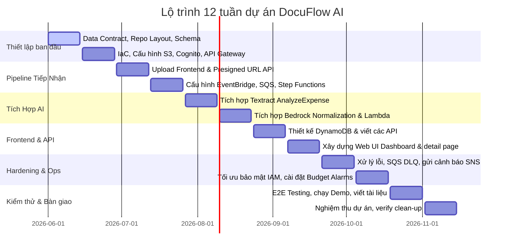

Tại phần này, chúng tôi trình bày bản đề xuất tổng quan và tài liệu đặc tả kỹ thuật chi tiết của dự án **DocuFlow AI** - Nền tảng xử lý hóa đơn và biên nhận thông minh sử dụng kiến trúc serverless trên nền tảng AWS.

---

# DocuFlow AI
## Nền tảng xử lý hóa đơn & biên nhận thông minh Serverless trên AWS
**Phiên bản:** AeroOps Team v1.0  
**Cập nhật ngày:** 24/06/2026  
**Đối tượng sử dụng:** Toàn bộ thành viên team AeroOps, Mentor và Reviewer.

---

## 1. Tổng quan dự án
**DocuFlow AI** là nền tảng xử lý hóa đơn (invoice) và biên nhận (receipt) thông minh, được xây dựng theo kiến trúc hướng sự kiện (event-driven) và hoàn toàn serverless trên nền tảng AWS. Hệ thống kết hợp **S3 triggers**, **AWS Step Functions**, **Amazon Textract** (OCR/Expense analysis) và **Amazon Bedrock (LLM)** để tự động hóa quá trình trích xuất, chuẩn hóa cấu trúc và kiểm thử dữ liệu tài chính. Việc đăng nhập và xác thực người dùng được bảo mật thông qua **Amazon Cognito**, và giao diện web tĩnh triển khai trên **AWS Amplify/CloudFront** cung cấp các chức năng tải lên tài liệu, theo dõi trạng thái thời gian thực và kiểm tra kết quả trích xuất.

---

## 2. Tuyên bố vấn đề & Giải pháp

### Bài toán kinh doanh (Vấn đề hiện tại)
Việc nhập dữ liệu hóa đơn và biên nhận thủ công hiện nay gây ra nhiều khó khăn lớn cho doanh nghiệp:
* **Tốn thời gian và dễ sai sót:** Nhập tay các thông tin như tên nhà cung cấp (vendor), ngày hóa đơn, tổng tiền, thuế, tiền tệ rất dễ nhầm lẫn.
* **Tài liệu phân tán:** Chứng từ nằm rải rác trên email, thư mục cá nhân, ứng dụng trò chuyện gây khó khăn cho việc quản lý tập trung và kiểm toán (audit).
* **Thiếu khả năng giám sát:** Không có hệ thống theo dõi trạng thái xử lý, không biết tài liệu nào thành công, tài liệu nào đang bị lỗi hoặc cần phê duyệt thủ công.
* **Thiếu dữ liệu phân tích:** Doanh nghiệp khó có thể tổng hợp nhanh chi phí theo tháng, theo nhà cung cấp hoặc thống kê tỷ lệ lỗi chứng từ.
* **Rủi ro bảo mật dữ liệu:** Tài liệu tài chính nhạy cảm thường được lưu trữ không mã hóa hoặc không được phân quyền truy cập chặt chẽ.

### Giải pháp từ DocuFlow AI
DocuFlow AI giải quyết các vấn đề trên thông qua luồng tự động hóa an toàn:
1. **Tiếp nhận tự động:** Người dùng đăng nhập an toàn và tải tệp lên trực tiếp Amazon S3 raw bucket bằng đường dẫn Presigned URL có thời gian hiệu lực ngắn.
2. **Luồng xử lý hướng sự kiện:** Sự kiện tải tệp lên S3 kích hoạt EventBridge gửi thông điệp vào hàng đợi SQS để điều phối và kích hoạt workflow AWS Step Functions.
3. **Trích xuất & Chuẩn hóa đa lớp:** Textract thực hiện OCR trích xuất dữ liệu thô, sau đó Amazon Bedrock tiến hành chuẩn hóa cấu trúc dữ liệu theo schema JSON thống nhất.
4. **Kiểm thử dữ liệu & Cảnh báo:** Một hàm Lambda thực hiện tính toán độ tin cậy (`confidenceScore`). Nếu dữ liệu đạt chuẩn sẽ được lưu dưới trạng thái `EXTRACTED`, ngược lại sẽ gắn nhãn `REVIEW_REQUIRED` và gửi cảnh báo qua Amazon SNS.
5. **Dashboard tập trung:** Giao diện web hiển thị danh sách hóa đơn kèm trạng thái xử lý chi tiết theo thời gian thực.

### Lợi ích và ROI (Hoàn vốn đầu tư)
* **Tối ưu hiệu suất:** Giảm thời gian nhập liệu và kiểm tra tài liệu xuống hơn 90% (tổng thời gian xử lý mỗi file dưới 60 giây).
* **Tiết kiệm chi phí:** Nhờ kiến trúc serverless thanh toán theo lượt sử dụng, chi phí vận hành hạ tầng ước tính chỉ khoảng **$0.70/tháng** đối với tập dữ liệu demo (5-10 file/ngày).
* **Chuẩn hóa dữ liệu nghiên cứu:** Dữ liệu JSON lưu trữ có cấu trúc có thể được truy vấn bằng Amazon Athena hoặc biểu diễn trực quan trên Amazon QuickSight.

---

## 3. Kiến trúc tổng quan
Hệ thống được thiết kế phân lớp hoàn toàn Serverless, đảm bảo tính decoupling (rời rạc) và bảo mật cao, chia làm 5 lớp chính: Frontend/Auth, Ingestion/API, Workflow Processing, Data Storage/Persistence và Observability/Security.


### Sơ đồ dịch vụ AWS sử dụng
* **Frontend & Xác thực:** 
  * **Amazon S3 & Amazon CloudFront:** Lưu trữ và phân phối an toàn giao diện web tĩnh.
  * **Amazon Cognito:** Đăng ký, đăng nhập người dùng và cấp JWT token cho API Gateway.
  * **AWS WAF:** Tường lửa bảo vệ API Gateway và CloudFront.
* **API & Ingestion (Tiếp nhận):**
  * **Amazon API Gateway:** Cung cấp endpoint RESTful cho yêu cầu sinh presigned URL, lấy danh sách và chi tiết hóa đơn.
  * **AWS Lambda (Presigned URL):** Tạo URL upload trực tiếp lên S3 với thời gian hiệu lực ngắn.
  * **Amazon S3 (Raw Bucket):** Lưu trữ các file hóa đơn gốc dạng PDF, JPG, PNG.
* **Workflow Processing (Quy trình xử lý):**
  * **Amazon EventBridge:** Nhận sự kiện tạo file mới trên S3 raw và route sang SQS.
  * **Amazon SQS + DLQ:** Đóng vai trò làm bộ đệm cô lập lỗi, tránh mất mát dữ liệu khi tải cao.
  * **AWS Lambda (Job Starter):** Đọc thông điệp từ SQS và kích hoạt luồng Step Functions.
  * **AWS Step Functions (Standard Workflow):** Điều phối toàn bộ các bước kiểm tra đầu vào, gọi Textract, gọi Bedrock, kiểm thử schema, lưu trữ kết quả và gửi thông báo.
* **Bộ phận AI/ML:**
  * **Amazon Textract (AnalyzeExpense):** Trích xuất thông tin OCR chuyên sâu dành cho hóa đơn/biên nhận.
  * **Amazon Bedrock (LLM):** Chuẩn hóa kết quả Textract thô thành JSON chuẩn, phân loại tài liệu và hỗ trợ giải thích lỗi.
* **Lưu trữ dữ liệu (Data Storage):**
  * **Amazon DynamoDB:** Lưu thông tin metadata, trạng thái xử lý, lỗi và tóm tắt kết quả.
  * **Amazon S3 (Processed Bucket):** Lưu trữ tệp JSON kết quả đã chuẩn hóa phục vụ phân tích.
* **Vận hành & Giám sát (Operations):**
  * **Amazon CloudWatch:** Quản lý logs, theo dõi metrics và kích hoạt alarms khi phát sinh lỗi hệ thống.
  * **Amazon SNS / SES:** Gửi email cảnh báo khi workflow gặp lỗi nặng hoặc khi dữ liệu trích xuất có độ tin cậy thấp.
  * **AWS CDK / SAM:** Công cụ quản lý cơ sở hạ tầng dưới dạng mã (IaC).

---

## 4. Triển khai kỹ thuật & Lộ trình 12 tuần

### Các giai đoạn triển khai chính
* **Giai đoạn 1 (Tuần 1-2): Thiết lập nền tảng & IaC:** Chốt dữ liệu schema, repo layout, viết file SAM/CDK nền tảng để tạo S3, Cognito và API Gateway.
* **Giai đoạn 2 (Tuần 3-4): Pipeline tiếp nhận dữ liệu:** Triển khai API sinh presigned URL, upload frontend, cấu hình EventBridge, SQS và khung Step Functions ban đầu.
* **Giai đoạn 3 (Tuần 5-6): Tích hợp AI:** Kết nối Textract AnalyzeExpense và viết Lambda điều phối Bedrock chuẩn hóa cấu trúc JSON.
* **Giai đoạn 4 (Tuần 7-8): Cơ sở dữ liệu & API Frontend:** Thiết kế DynamoDB, viết các API GET/PATCH và hoàn thiện giao diện Dashboard của người dùng.
* **Giai đoạn 5 (Tuần 9-10): Bảo mật, Giám sát & Cảnh báo:** Hardening IAM roles, thiết lập alarms trên CloudWatch, SNS alerts khi có lỗi và cài đặt ngân sách (budget alerts).
* **Giai đoạn 6 (Tuần 11-12): Kiểm thử E2E & Clean-up:** Thực hiện chạy demo toàn hệ thống, tối ưu hóa hiệu năng và viết script tự động xóa toàn bộ tài nguyên (clean-up) để bảo vệ tài khoản AWS.

### Lộ trình chi tiết 12 tuần


---

## 5. Ước tính ngân sách & Kiểm soát chi phí

### Ước tính chi phí vận hành (Cho 300 hóa đơn/tháng)
* **AWS Lambda:** $0.00/tháng (Nằm hoàn toàn trong Free Tier).
* **Amazon S3 (Lưu trữ và Request):** ~$0.15/tháng (lưu trữ 6GB file raw và kết quả JSON).
* **AWS Amplify (Hosting frontend):** ~$0.35/tháng.
* **Amazon API Gateway:** ~$0.01/tháng (cho 2,000 requests/tháng).
* **AWS Glue ETL & Crawlers (Optional):** ~$0.09/tháng.
* **Amazon Textract (AnalyzeExpense):** ~$0.08/tháng.
* **Amazon Bedrock (Claude 3 Haiku / model nhỏ):** ~$0.02/tháng.
* **Truyền tải dữ liệu & SNS Alerts:** ~$0.02/tháng.

**Tổng chi phí ước tính:** **~$0.70 USD/tháng** (chưa bao gồm thuế và các thiết bị phần cứng cá nhân).

### Quy định kiểm soát chi phí
* **Cảnh báo ngân sách (AWS Budgets):** Thiết lập cảnh báo tự động gửi email khi chi phí vượt quá **$5.00** và **$10.00**.
* **Giới hạn kích thước file:** Hàm Lambda validate đầu vào sẽ từ chối các file lớn hơn **5 MB** hoặc có số trang vượt quá **3 trang** để tránh các hóa đơn khổng lồ làm tăng chi phí Textract/Bedrock vô tội vạ.
* **Vòng đời dữ liệu (Lifecycle Rules):** Tự động xóa các file trong raw và processed bucket sau 14 ngày để tiết kiệm chi phí lưu trữ tích lũy.

---

## 6. Đánh giá rủi ro & Biện pháp khắc phục

| Rủi ro xác định | Ảnh hưởng | Xác suất | Biện pháp giảm thiểu |
| :--- | :--- | :--- | :--- |
| **Bedrock phản hồi JSON sai cấu trúc** | Trung bình | Trung bình | Viết hàm Lambda kiểm thử cấu trúc JSON ngay sau bước Bedrock. Nếu cấu trúc sai, chuyển trạng thái về `FAILED` hoặc `REVIEW_REQUIRED` và thực hiện retry. |
| **Chất lượng ảnh mờ / Chữ viết tay lỗi OCR** | Cao | Trung bình | Áp dụng chính sách kiểm duyệt dựa trên độ tin cậy (`confidenceScore`). Nếu điểm số thấp, gắn cờ `REVIEW_REQUIRED` để người dùng xác nhận lại trên frontend. |
| **Model Bedrock không hỗ trợ tại Region hiện tại** | Cao | Thấp | Xác thực kỹ tính khả dụng của mô hình tại Region chạy thử (ví dụ `us-east-1` hoặc `ap-southeast-1`). Có phương án dự phòng model hoặc cross-region gọi API. |
| **Lộ khóa bảo mật / Credentials leak** | Nghiêm trọng| Thấp | Cấm hoàn toàn việc hard-code AWS access key trong mã nguồn. Cấu hình phân quyền IAM chi tiết theo nguyên tắc Least Privilege (quyền hạn tối thiểu). |

---

## 7. Kết quả kỳ vọng
* **Hệ thống tự động hóa:** Chuyển đổi dữ liệu hóa đơn phi cấu trúc (PDF/Image) thành định dạng JSON có cấu trúc chỉ trong vòng dưới 60 giây.
* **Độ chính xác cao:** Đạt tỷ lệ trích xuất chính xác **>= 90%** đối với các trường thông tin tài chính cốt lõi (vendorName, invoiceDate, totalAmount, taxAmount, currency).
* **Vận hành an toàn:** Dễ dàng triển khai thông qua IaC và có script xóa sạch tài nguyên một cách nhanh chóng để tránh phát sinh chi phí sau khi hoàn thành workshop.

---

# Phụ lục: Tài liệu đặc tả kỹ thuật chi tiết
Dưới đây là các phần mô tả chi tiết về Data Contract, API, quy trình công việc và sự phân chia công việc trong đội ngũ dự án.

## A. Scope MVP chi tiết & Tiêu chí thành công

### Yêu cầu MVP bắt buộc
* **Xác thực người dùng:** Login/Register qua Amazon Cognito User Pool.
* **Tải tệp trực tiếp:** Sinh presigned URL từ API Gateway -> Lưu file trực tiếp vào S3 raw bucket.
* **Bộ đệm xử lý:** Event Bridge -> SQS (+DLQ) -> Lambda Job Starter.
* **Điều phối luồng:** AWS Step Functions điều khiển pipeline logic.
* **Trích xuất thông minh:** Textract AnalyzeExpense (OCR thô) + Bedrock (chuẩn hóa dữ liệu).
* **Lưu trữ dữ liệu:** Lưu kết quả metadata vào DynamoDB và file JSON kết quả vào S3 processed.
* **Giao diện web:** Trang danh sách hóa đơn, trang tải lên và trang chi tiết kết quả.
* **Giám sát & Alarms:** Alarms CloudWatch theo dõi lỗi Lambda/SQS DLQ và gửi thông báo qua SNS.

### Các thành phần nằm ngoài phạm vi MVP (Non-Goals)
* Trích xuất các tài liệu dài như hợp đồng, điều khoản mua hàng phức tạp.
* Xây dựng luồng phê duyệt nhiều cấp bậc (approval workflow) giống như hệ thống kế toán thực tế.
* Lưu trữ các khóa bí mật (Secrets/Access keys) trong code repository.

---

## B. Dữ liệu chuẩn hóa & Cấu trúc lưu trữ (Data Contract)

### JSON Schema chuẩn hóa đầu ra
Tất cả các tài liệu sau khi xử lý thành công bắt buộc phải có cấu trúc JSON như sau:

```json
{
  "documentId": "doc-001",
  "userId": "user-123",
  "fileName": "invoice-001.pdf",
  "documentType": "INVOICE",
  "status": "EXTRACTED",
  "vendorName": "ABC Company",
  "invoiceDate": "2026-06-01",
  "currency": "VND",
  "totalAmount": 2500000,
  "taxAmount": 250000,
  "confidenceScore": 0.91,
  "lineItems": [
    {
      "description": "Cloud service fee",
      "quantity": 1,
      "unitPrice": 2250000,
      "amount": 2250000
    }
  ],
  "s3RawPath": "s3://raw-bucket/user-123/doc-001.pdf",
  "s3ProcessedPath": "s3://processed-bucket/user-123/doc-001.json",
  "createdAt": "2026-06-08T10:00:00Z",
  "updatedAt": "2026-06-08T10:01:00Z",
  "errorMessage": null
}
```

### Các trạng thái của tài liệu
```
UPLOADED → PROCESSING → [EXTRACTED | REVIEW_REQUIRED | FAILED]
```
* **UPLOADED:** Tệp tin đã được upload lên S3 Raw thành công, bản ghi khởi tạo đã được lưu vào DB.
* **PROCESSING:** Luồng xử lý AWS Step Functions đang chạy.
* **EXTRACTED:** Trích xuất thành công, confidenceScore >= 0.80 và đầy đủ các trường thông tin bắt buộc.
* **REVIEW_REQUIRED:** Quá trình trích xuất hoàn tất nhưng thiếu thông tin quan trọng hoặc confidenceScore < 0.80.
* **FAILED:** Lỗi trong quá trình validate đầu vào hoặc phát sinh ngoại lệ không thể khôi phục trong lúc gọi Textract/Bedrock.

### Thiết kế bảng DynamoDB
* **Tên bảng:** `DocuFlowDocuments`
* **Partition Key (PK):** `documentId` (string)
* **GSI 1 Partition Key:** `userId` (string)
* **GSI 1 Sort Key:** `createdAt` (string) (Hỗ trợ hiển thị danh sách hóa đơn theo người dùng sắp xếp theo thời gian)
* **GSI 2 Partition Key:** `status` (string)
* **GSI 2 Sort Key:** `createdAt` (string) (Hỗ trợ lọc nhanh các hóa đơn lỗi hoặc cần review)

### Quy ước đặt tên S3 Object
* **Raw Bucket:**
  `raw/{userId}/{yyyy}/{mm}/{dd}/{documentId}/{originalFileName}`
* **Processed Bucket:**
  `processed/{userId}/{yyyy}/{mm}/{dd}/{documentId}/result.json`  
  `processed/{userId}/{yyyy}/{mm}/{dd}/{documentId}/textract-raw.json`  
  `processed/{userId}/{yyyy}/{mm}/{dd}/{documentId}/bedrock-normalized.json`

---

## C. Đặc tả API Contract

### Chi tiết Endpoint RESTful
* **POST `/documents/upload-url`**
  * *Chức năng:* Trả về presigned URL để client upload trực tiếp file lên S3.
  * *Tham số truyền lên (Request Body):*
    ```json
    {
      "fileName": "invoice-001.pdf",
      "contentType": "application/pdf",
      "fileSize": 512000
    }
    ```
  * *Dữ liệu trả về (Response):*
    ```json
    {
      "documentId": "doc-001",
      "uploadUrl": "https://s3-presigned-url...",
      "s3Key": "raw/user-123/2026/06/24/doc-001/invoice-001.pdf",
      "expiresIn": 300
    }
    ```
* **GET `/documents`**
  * *Chức năng:* Trả về danh sách tất cả các hóa đơn của người dùng đang đăng nhập.
  * *Headers:* `Authorization: Bearer <JWT Token>`
  * *Dữ liệu trả về:* Mảng chứa các đối tượng metadata của hóa đơn.
* **GET `/documents/{documentId}`**
  * *Chức năng:* Lấy thông tin chi tiết kết quả trích xuất của một hóa đơn cụ thể.
  * *Headers:* `Authorization: Bearer <JWT Token>`
  * *Dữ liệu trả về:* File JSON chi tiết hóa đơn (Document JSON).

---

## D. Chi tiết Workflow xử lý

### Quy trình Step Functions (ASL Logic)
1. **ValidateInput:** Thực hiện kiểm tra định dạng file (chấp nhận PDF, PNG, JPG), kích thước (< 5MB) và số trang (< 3).
2. **UpdateStatusProcessing:** Cập nhật trạng thái DynamoDB sang `PROCESSING`.
3. **RunTextractAnalyzeExpense:** Gọi dịch vụ Amazon Textract để phân tích hóa đơn và lấy thông tin OCR thô.
4. **NormalizeWithBedrock:** Nén dữ liệu Textract thô và gửi request sang Amazon Bedrock để chuẩn hóa thông tin.
5. **ValidateNormalizedJson:** Đọc phản hồi của Bedrock, parse thành JSON và kiểm tra tính hợp lệ của schema.
6. **CalculateConfidence:** Tính toán điểm tin cậy tổng hợp.
7. **Bộ rẽ nhánh (Choice State):**
   * Nếu `confidenceScore >= 0.80` và đầy đủ thông tin: Cập nhật trạng thái `EXTRACTED`, lưu dữ liệu vào DynamoDB và xuất tệp JSON kết quả ra S3 processed.
   * Nếu `confidenceScore < 0.80` hoặc thiếu thông tin: Cập nhật trạng thái `REVIEW_REQUIRED`, lưu dữ liệu, xuất tệp JSON kết quả ra S3 processed và kích hoạt SNS Alert gửi email cho người quản trị.
   * Nếu xảy ra lỗi hệ thống: Chuyển hướng sang trạng thái `FAILED`, ghi nhận thông điệp lỗi và gửi SNS Alert khẩn cấp.

### Hướng dẫn thiết lập Bedrock Prompt
Prompt hệ thống gửi đến Bedrock để chuẩn hóa dữ liệu yêu cầu tuân thủ cấu trúc sau:
```text
You are an invoice and receipt data extraction normalizer.
Your task is to take raw OCR outputs and structure them into the requested JSON schema.
Only return valid, parsable JSON matching the following keys:
{
  "documentType": "INVOICE|RECEIPT|UNKNOWN",
  "vendorName": "string|null",
  "invoiceDate": "YYYY-MM-DD|null",
  "currency": "VND|USD|UNKNOWN",
  "totalAmount": number|null,
  "taxAmount": number|null,
  "confidenceScore": number,
  "missingFields": []
}
Do not write markdown, do not wrap in backticks, do not write explanations.
```

---

## E. Bảo mật & IAM Role Mapping

### Phân quyền chi tiết (Least Privilege)
* **UploadUrlLambdaRole:**
  * Cho phép `s3:PutObject` vào prefix `raw-bucket/raw/${cognito-sub}/*`.
  * Cho phép `dynamodb:PutItem` vào bảng `DocuFlowDocuments`.
* **JobStarterLambdaRole:**
  * Cho phép `sqs:ReceiveMessage` và `sqs:DeleteMessage` đối với queue xử lý.
  * Cho phép `states:StartExecution` trên ARN của Step Functions.
* **StateMachineRole:**
  * Cho phép `lambda:InvokeFunction` đối với các hàm xử lý trong workflow.
  * Cho phép `sns:Publish` đối với topic nhận thông báo lỗi.
  * Cho phép ghi logs vào CloudWatch.
* **ExtractionLambdaRole:**
  * Cho phép `s3:GetObject` trên raw bucket và `s3:PutObject` trên processed bucket.
  * Cho phép gọi `textract:AnalyzeExpense`.
  * Cho phép gọi `bedrock:InvokeModel` để gửi prompt tới LLM.

---

## F. Phân chia công việc trong đội ngũ (RACI Matrix)

### Phân công vai trò 5 thành viên
* **Thành viên 1 (Frontend, Auth & Ingestion API):** Quản lý Cognito User Pool, xây dựng giao diện Đăng ký/Đăng nhập và Tải lên file, thiết lập API Gateway sinh Presigned URL.
* **Thành viên 2 (Ingestion Queue & Step Functions):** Quản lý các sự kiện S3, hàng đợi SQS + DLQ, Lambda Job Starter và viết sơ đồ trạng thái AWS Step Functions.
* **Thành viên 3 (AI Extraction & Normalization):** Thiết lập kết nối Textract, thiết kế và tối ưu hóa hệ thống Prompt gửi tới Bedrock, viết logic kiểm tra schema kết quả.
* **Thành viên 4 (Data Storage & Analytics):** Thiết kế DynamoDB Table & các Global Secondary Indexes (GSIs), cấu hình S3 processed bucket và chuẩn bị Glue Crawlers/Athena queries.
* **Thành viên 5 (Observability, Security & IaC):** Viết script triển khai IaC bằng SAM/CDK, cấu hình phân quyền IAM, thiết lập CloudWatch Alarms, SNS alerts và chuẩn bị script clean-up.

### Bảng RACI
* **R (Responsible):** Người thực hiện công việc.
* **A (Accountable):** Người chịu trách nhiệm chính/Phê duyệt.
* **C (Consulted):** Người được tham vấn/đóng góp ý kiến.
* **I (Informed):** Người nhận thông tin sau khi hoàn thành.

| Công việc | Thành viên 1 | Thành viên 2 | Thành viên 3 | Thành viên 4 | Thành viên 5 |
| :--- | :---: | :---: | :---: | :---: | :---: |
| **Thiết kế Data Contract & Schemas** | C | C | **R** | C | **A** |
| **Xây dựng API Endpoints** | **R** | C | I | **A** | I |
| **Thiết kế Step Functions Workflow** | I | **R** | C | I | **A** |
| **Thiết kế Bedrock Prompt & Validate** | I | C | **R** | C | **A** |
| **Thiết kế Database & Queries** | C | I | C | **R** | **A** |
| **Triển khai Infrastructure & Bảo mật** | C | C | C | C | **R** / **A** |

---

## G. Tiêu chí hoàn thành (Definition of Done - DoD)
Một đầu việc chỉ được đánh dấu là hoàn thành khi đáp ứng các tiêu chuẩn:
1. **Chất lượng mã nguồn:** Không chứa thông tin credentials nhạy cảm, áp dụng phân quyền Least Privilege.
2. **Review:** PR được duyệt bởi ít nhất một thành viên khác trong đội ngũ.
3. **Tính toàn vẹn dữ liệu:** File JSON kết quả đầu ra phải tuân thủ đúng schema cấu trúc và đường dẫn quy ước trên S3.
4. **Xử lý lỗi:** Các lỗi tạm thời phải được tự động retry, lỗi nghiêm trọng phải chuyển trạng thái DynamoDB sang `FAILED` và gửi tin nhắn lỗi vào SQS DLQ.
5. **Giám sát:** Kích hoạt Logs, thiết lập CloudWatch alarms và cấu hình SNS nhận thông báo.
6. **Mô tả triển khai:** Cập nhật tài liệu hướng dẫn setup cục bộ, câu lệnh deploy và chạy script xóa sạch (clean-up) tài nguyên sau khi kiểm thử.
7. **Quản lý chi phí:** Đã thiết lập thành công AWS Budget cảnh báo ở mức $5 và $10.