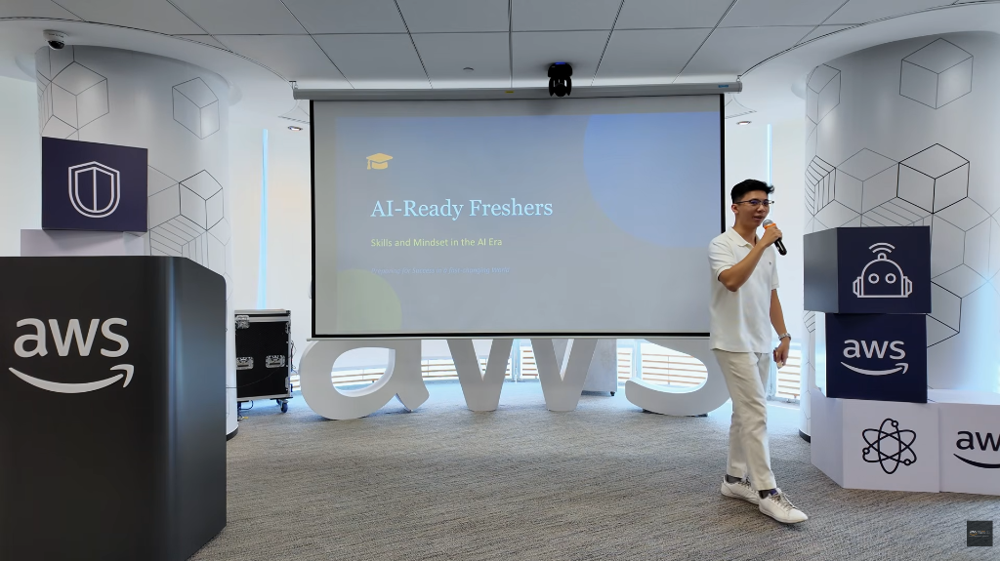
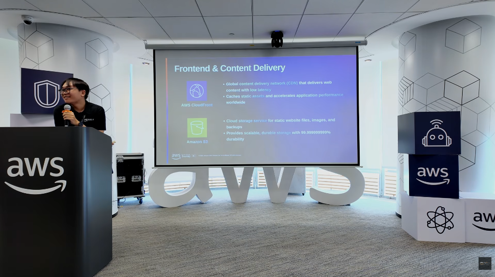
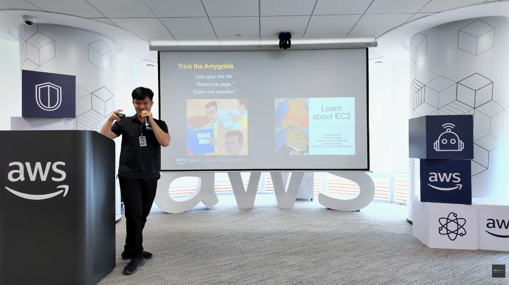
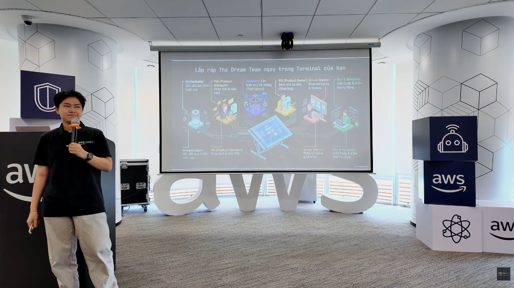

# FCAJ Community Day

### Tổng quan sự kiện

- **Tên Sự Kiện:** FCAJ Community Day
- **Thời gian tổ chức:** 09/05/2026
- **Địa điểm tổ chức:** Tầng 26 - Văn phòng AWS Việt Nam (Tòa nhà Bitexco, Số 2 Hải Triều, Phường Sài Gòn, TP.HCM)
- **Đơn vị tổ chức:** Cộng đồng FCAJ (với sự hỗ trợ của AWS Study Group).
- **Mục Đích Của Sự Kiện:**
  - Chia sẻ các kiến thức về kỹ thuật (technical) và các phương pháp học tập, định hướng nghề nghiệp cho các bạn sinh viên và người làm IT.
  - Giúp người tham dự xây dựng tư duy học tập hiệu quả, nắm bắt kỹ năng làm việc với AI và chuẩn bị hành trang để gia nhập thị trường lao động.
  - "Hack" não bộ để học tập hiệu quả, kỹ thuật Prompt Engineering, tư duy của nhà tuyển dụng khi phỏng vấn, và phương pháp phát triển phần mềm BMX kết hợp với AI.
  - Kiến thức chuyên môn về AWS, AI, kinh nghiệm thực tế từ các chuyên gia; cơ hội kết nối và rèn luyện kỹ năng thuyết trình.

### Danh Sách Diễn Giả

1. **Diễn giả 1:** Huỳnh Hoàng Long - Chia sẻ về chủ đề "Hack não để nghiện học".
2. **Diễn giả 2:** Nguyễn Tuấn Thịnh - Chia sẻ về "Ultimate Prompt Engineering".
3. **Diễn giả 3 (Anh Khang):** Solution Architect tại Cloud Kinetics (đã làm việc 3 năm).
4. **Diễn giả 4 (Chị Thảo):** Software Developer tại Ngân hàng Quốc tế Việt Nam (VIB).

### Nội Dung Nổi Bật

- **Tổng quan vấn đề:** Sự trì hoãn trong học tập do não bộ ưu tiên phần thưởng nhanh từ mạng xã hội/game; sự quá tải thông tin trong thời đại AI khiến sinh viên hoang mang về định hướng.
- **Giải pháp được giới thiệu:**
  - Biến học tập thành một "canh bạc Dopamine" để tạo hứng thú.
  - Kỹ thuật Prompt Engineering chuyên sâu để tối ưu kết quả từ AI.
  - Tập trung vào kiến thức nền tảng (Foundation) và kỹ năng đặt câu hỏi "Tại sao" (Why) thay vì chỉ học công cụ.
  - Phương pháp BMX (Branch-Method for Hi-Value Development): Chia nhỏ dự án thành các task và tài liệu (document) chuẩn chỉnh để AI hỗ trợ code mà không bị lỗi ngữ cảnh.
- **Công nghệ/Dịch vụ/Công cụ:** AWS (CloudFront, S3, Cognito, API Gateway, Lambda, Bedrock, DynamoDB), AI (ChatGPT, Claude, Gemini, Bedrock), Extension "Optimizer".
- **Demo hoặc Case Study:** Demo công cụ tối ưu Prompt ngay trên trình duyệt; thiết kế giải pháp kiến trúc (Solution Architecture) cho một dự án cuối khóa trên AWS.
- **Các điểm đáng chú ý:** AI chỉ đóng vai trò "khuếch đại" (amplify) năng lực — nếu bạn tệ, AI làm bạn tệ hơn; nếu bạn giỏi, AI giúp bạn năng suất hơn.

### Những Gì Học Được

- **Tư duy và phương pháp:** Quy tắc 2 phút (việc gì làm dưới 2 phút thì làm ngay); tư duy "Question Everything" (luôn đặt câu hỏi tại sao).
- **Kiến thức kỹ thuật:** Cách vận hành của các dịch vụ Serverless trên AWS; cơ chế hoạt động của Token trong AI và các kỹ thuật như Chain of Thought, Tree of Thought.
- **Best practices:** Cung cấp đầy đủ ngữ cảnh và ví dụ khi viết Prompt; không yêu cầu AI làm toán phức tạp; chia nhỏ đầu việc để tránh hiện tượng AI bị "ảo giác" (hallucination).
- **Kinh nghiệm thực tế:** Nhà tuyển dụng ưu tiên người có tư duy tốt (thought process) hơn là người chỉ biết làm đúng kết quả nhờ AI; tầm quan trọng của sự chính trực (integrity) và nhìn nhận dài hạn.

### Ứng Dụng Vào Công Việc

- **Có thể áp dụng gì cho dự án hiện tại:** Sử dụng phương pháp chia nhỏ module và viết document kỹ lưỡng trước khi nhờ AI hỗ trợ code (phương pháp BMX).
- **Công nghệ muốn thử nghiệm:** Trải nghiệm Amazon Bedrock để truy cập các mô hình nền tảng; sử dụng DynamoDB cho các ứng dụng cần tốc độ phản hồi nhanh.
- **Ý tưởng cải thiện quy trình làm việc:** Thiết lập môi trường học tập và làm việc (decor bàn học) để tạo cảm hứng; tạo chuỗi thói quen (streak) giống như chơi game để duy trì tính kiên trì.

### Trải Nghiệm Trong Event

- **Học hỏi từ diễn giả:** Tiếp cận góc nhìn thực tế của người đi trước về thị trường lao động IT và cách vượt qua những sai lầm.
- **Trải nghiệm thực hành:** Xem demo trực tiếp về cách tối ưu hóa các câu lệnh Prompt và cách build một hệ thống trên Cloud.
- **Giao lưu và kết nối:** Khuyến khích tham gia các cộng đồng, xây dựng mạng lưới (network) và làm việc nhóm thay vì đi một mình.
- **Điều ấn tượng nhất:** Quan điểm về việc "không nên làm intern không lương" vì giá trị của bản thân và trách nhiệm trong công việc.

### Bài Học Rút Ra

- **Kiến thức quan trọng nhất:** Nền tảng (Foundation) là cái không thay đổi trong một thế giới thay đổi quá nhanh.
- **Kinh nghiệm thực tế:** Sai lầm là một phần của sự phát triển; cần mắc sai lầm sớm và nhiều để trưởng thành.
- **Định hướng học tập hoặc phát triển tiếp theo:** Tập trung xây dựng sự kiên trì (persistence) và thái độ chuyên nghiệp thay vì chỉ chạy theo các Framework hot.

### Một số hình ảnh khi tham gia sự kiện

