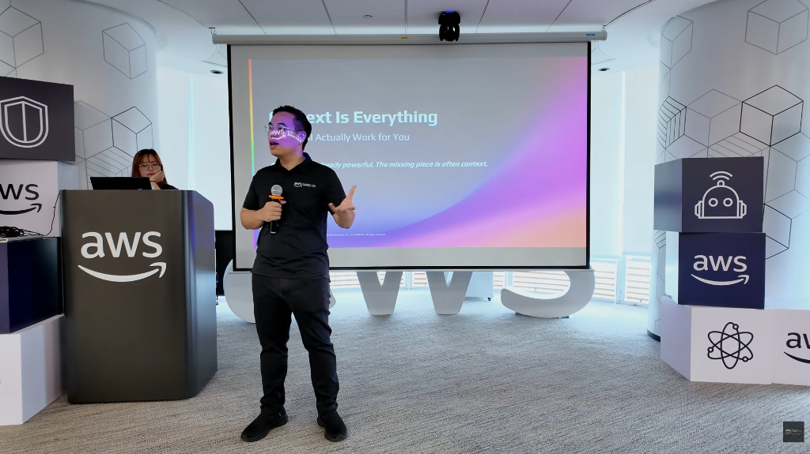
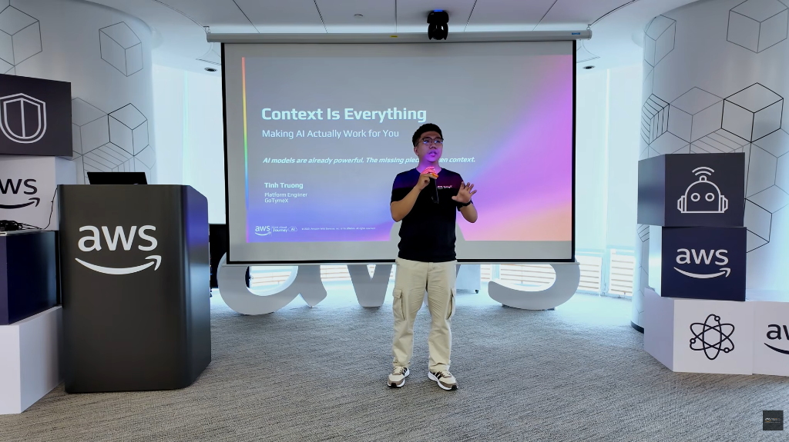
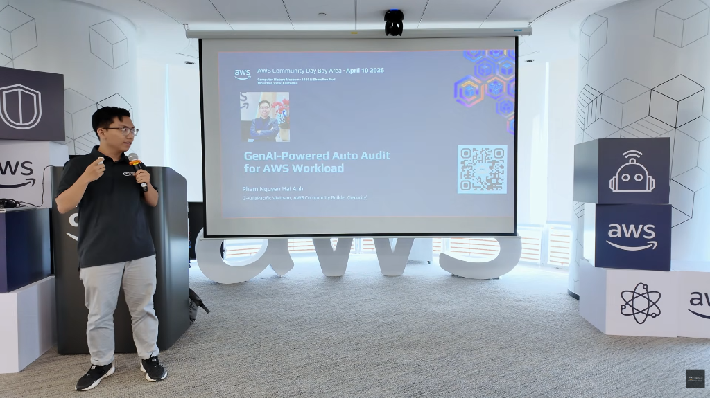
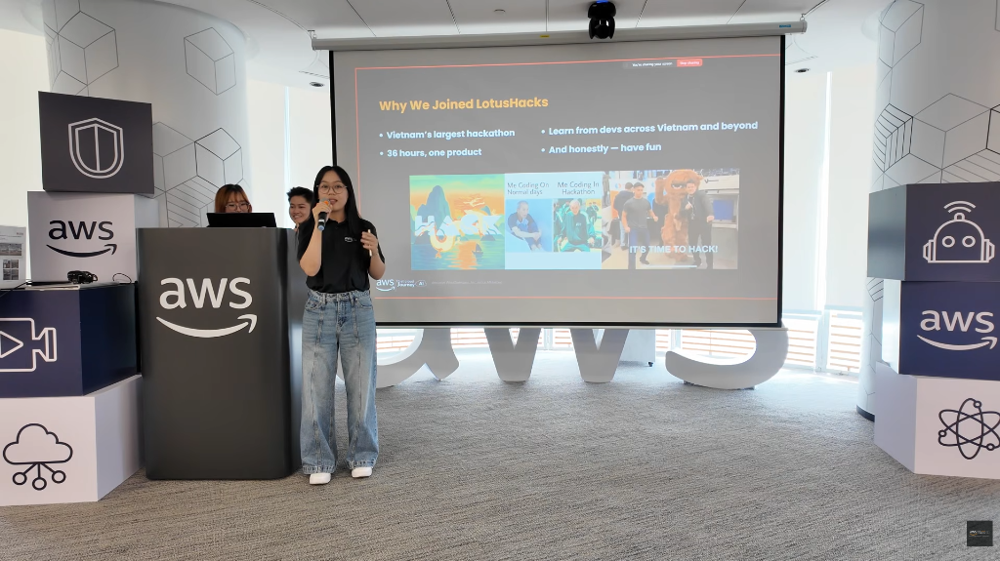
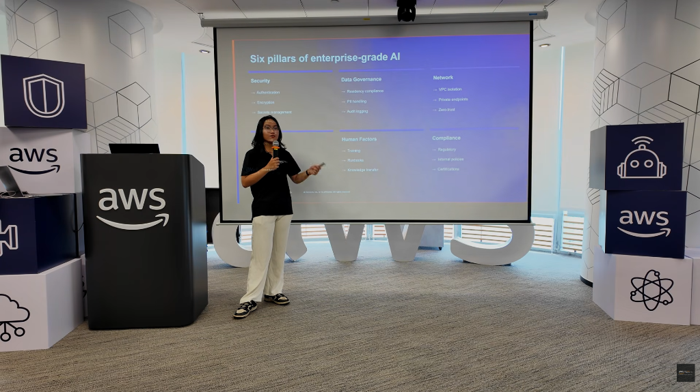

# FCAJ Community Day

### Event Overview

- **Event Name:** FCAJ Community Day
- **Date:** 23/05/2026
- **Location:** 26th Floor - AWS Vietnam Office (Bitexco Building, 2 Hai Trieu, Saigon Ward, Ho Chi Minh City).
- **Organizer:** FCAJ Community (supported by AWS Study Group).
- **Event Objectives:**
  - Not just a simple audio-visual seminar, but a place for members to connect and inspire each other in the technology field.
  - Provide a realistic view of the job market in the AI era.
  - Share technical knowledge ranging from AI and Cloud to practical experiences in projects and hackathons.
  - Main message to convey: A proactive learning spirit, equipping practical knowledge (case studies) and real products rather than relying solely on degrees or theoretical demos.
  - Value for attendees: Opportunities to connect with potential partners, learn practical experience from top industry speakers, and update on the latest tech trends such as AI Agents, CloudFront pricing, and Multi-agent systems.

### Speakers List

1. **Mr. Nguyen Gia Hung:**
   - Position: Solution Architect at AWS Vietnam.
   - Role: Founder of FCAJ, opening speaker on market trends.
2. **Mr. Tinh Truong:**
   - Position: Platform Engineer.
   - Company: Got It (Gothamic).
3. **Mr. Hai Anh:**
   - Company: Pacific Vietnam.
4. **Mr. Nguyen Tuan Thinh:**
   - Position: DevOps Engineer.
5. **UTM Team (Uyen, Thao, Mach):** Winning team at a Hackathon competition.
6. **Female Speaker (Ms. Vy):**
   - Company: VPBank (shared about Multi-agent systems in banking).

### Key Highlights

- **Problem Overview:**
  - The job market is changing drastically due to AI, making software development cheaper but increasing the demand for operations (Platform Engineering).
  - Fears of unexpected Cloud costs ("Bill spikes") when using the Pay-as-you-go model.
  - The lack of determinism of Large Language Models (LLMs) in enterprise environments.
- **Introduced Solutions:**
  - Use Amazon CloudFront Flat-rate pricing to fix monthly CDN costs.
  - Build Multi-agent systems to solve complex problems like credit scoring.
  - Provide accurate and sufficient Context for AI to optimize outputs.
- **Technologies/Services/Tools:** AWS CloudFront, Amazon QuickSight, Amazon Bedrock, Terraform, Obsidian (for AI Second Brain), and LLM models (GPT, Llama, Claude).
- **Demo or Case Study:**
  - UTMorpho Project: A tool for direct UI editing using AI built in a 36-hour Hackathon.
  - Credit scoring system for Startups: Using Multi-agent to analyze non-traditional data for banks.
- **Notable Points:** The importance of Security & Compliance in large enterprises; AI is not just a chatbot but must know how to act (Agentic AI).

### What Was Learned

- **Mindset and Methods:**
  - AI Mindset & AI Adoption: How to apply AI effectively to business processes.
  - Working Backwards: Starting from customer needs to build systems.
- **Technical Knowledge:** Understanding the Temperature parameter (t=0 is not completely deterministic on the Cloud due to hardware optimization), CDN multi-tier caching mechanisms, and VPC Origin security.
- **Best Practices:** Always test multiple times, use JSON Mode to stabilize AI output formats, and rotate API Keys frequently.
- **Practical Experience:** In enterprises, "Ship in, Ship out" (Garbage in, Garbage out), requiring human intervention to verify AI knowledge.

### Application to Work

- **What can be applied:** Designing AI systems capable of parallel processing and audit trails.
- **Technologies to test:** Deploying infrastructure using Terraform (IaC) for easy management and environment reproduction.
- **Ideas to improve workflow:** Integrating AI Agents to automate meeting summaries and send follow-up action emails to stakeholders.

### Event Experience

- **Learning from speakers:** "Painful" real-world stories about copying GPT code causing errors in production.
- **Hands-on experience:** Watching live demos on how AI streams HTML source code and allows drag-and-drop UI editing.
- **Networking:** Encouraging attendees to initiate conversations with people sitting next to them as they could be future partners.
- **Most impressive point:** The enthusiasm of the community and the willingness to share failures and practical lessons.

### Key Takeaways

- **Most important knowledge:** AI is a probabilistic model, not deterministic, so systems need to be designed to handle this randomness.
- **Practical experience:** Don't just show a demo, provide a product with real value to end-users.
- **Learning or future development orientation:** Focus on solid Software Engineering knowledge alongside AI skills to deploy practical products instead of just working in a lab.

### Some event photos

