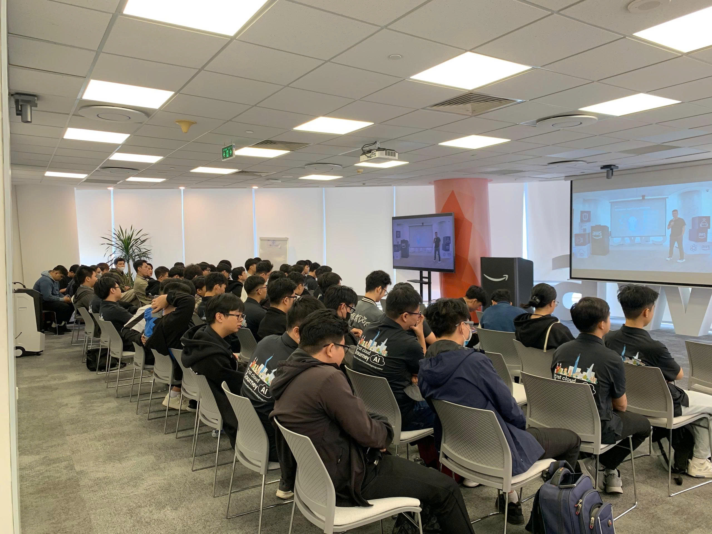
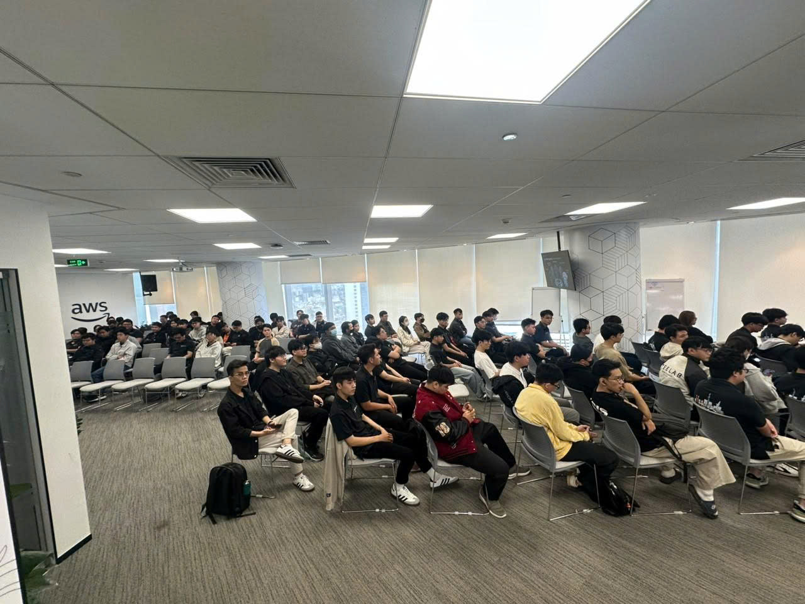
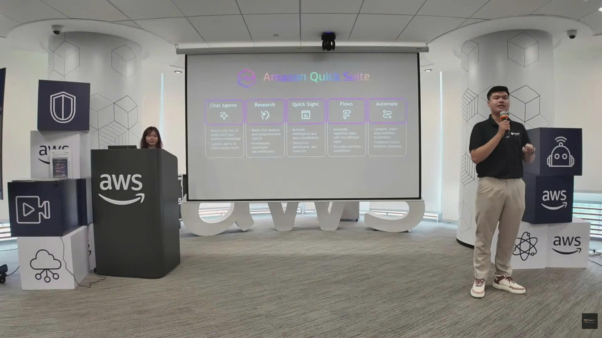
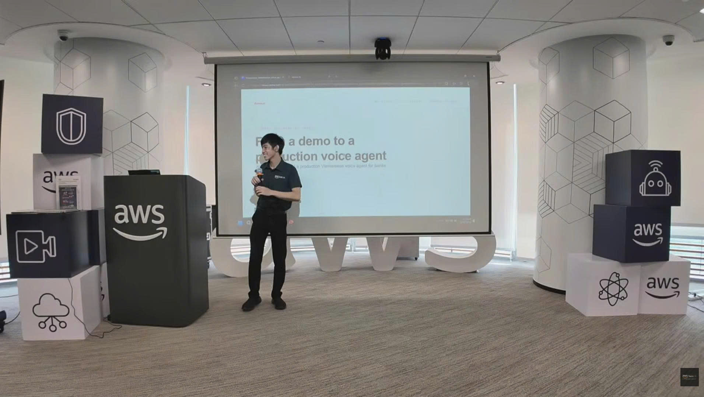

# FCAJ Community Day

### Tổng quan sự kiện
- **Tên Sự Kiện:** FCAJ Community Day
- **Thời gian tổ chức:** 27/06/2026
- **Địa điểm tổ chức:** Tầng 26 - Văn phòng AWS Việt Nam (Tòa nhà Bitexco, Số 2 Hải Triều, Phường Sài Gòn, TP.HCM).
- **Đơn vị tổ chức:** Cộng đồng FCAJ (với sự hỗ trợ của AWS Study Group).
- **Mục Đích Của Sự Kiện:**
  - Tạo không gian cho các diễn giả từ nhiều doanh nghiệp chia sẻ kinh nghiệm, trải nghiệm và góc nhìn thực tế trong môi trường làm việc chuyên nghiệp cho cộng đồng.
  - Hướng nghiệp cho sinh viên, cập nhật các xu hướng công nghệ mới nhất về Cloud và AI, và giới thiệu các giải pháp tối ưu hóa vận hành doanh nghiệp.

### Danh Sách Diễn Giả
1. **Steve Trần:** Founder của Cloud Thinker.
2. **Danh Nghị:** Diễn giả từ Renova Cloud.
3. **Anh Kiệt:** Đại diện từ AWS Student Community Group.
4. **Anh Trung:** Founder & CEO của startup R AI.
5. **Chị Bảo:** Cloud Engineer tại Cloud Kinetic.
6. **Anh Nguyên Nguyễn:** Cloud Engineer tại Cloud Kinetic.
7. **Anh Trường (Wayne):** Chuyên gia AI Solution tại Noventic.
8. **Chị Minh Anh:** Thuộc team Solution SHA từ Noventic.
9. **Anh Toàn Nguyễn:** AWS Security Builder.

### Nội Dung Nổi Bật
- **Tổng quan vấn đề:** Doanh nghiệp đối mặt với sự phức tạp của hệ thống (complexity), nợ công nghệ (technical debt), và áp lực tuyển dụng nhân sự chất lượng cao trong kỷ nguyên AI.
- **Giải pháp được giới thiệu:**
  - **Agentic Platform:** Nền tảng AI hỗ trợ vận hành hạ tầng Cloud.
  - **Voice AI Agent:** Giải pháp giọng nói AI cho ngân hàng và tổng đài.
  - **DevOps AI Agent:** Tự động hóa điều tra và xử lý sự cố hệ thống.
  - **Amazon Q (Quick):** Trợ lý AI cho HR và bảo mật doanh nghiệp.
- **Công nghệ/Dịch vụ/Công cụ:** AWS Cloud, Amazon Bedrock, Amazon Q, kiến trúc Multi-agent, MCP (Model Context Protocol).
- **Demo hoặc Case Study:**
  - Demo Voice Agent trả lời câu hỏi về sản phẩm Apple bằng tiếng Anh.
  - Case study xử lý tấn công DDoS trên ứng dụng thương mại điện tử bằng DevOps Agent.
  - Ứng dụng lọc và đánh giá CV tự động cho bộ phận HR.
- **Các điểm đáng chú ý:** Tốc độ điều tra lỗi của AI tính bằng phút, trong khi con người mất hàng giờ; AI không thay thế con người mà sẽ hỗ trợ những người biết sử dụng nó tốt nhất.

### Những Gì Học Được
- **Tư duy và phương pháp:** Sinh viên nên trải nghiệm sớm môi trường doanh nghiệp để tích lũy kinh nghiệm thực tế thay vì chỉ học lý thuyết.
- **Kiến thức kỹ thuật:** Sự khác biệt và ưu nhược điểm giữa kiến trúc Single-agent và Multi-agent; cách xây dựng hệ thống Voice AI hỗ trợ tiếng Việt.
- **Best practices:** Để AI hoạt động tốt, hệ thống cần có khả năng quan sát (Observability) tốt và dữ liệu đầy đủ.
- **Kinh nghiệm thực tế:** Bài học về việc "làm trước nghĩ sau" (execution) trong startup và cách chọn lựa khách hàng mục tiêu để giải quyết bài toán thực tế.

### Ứng Dụng Vào Công Việc
- **Dự án hiện tại:** Có thể áp dụng AI Agent để tự động hóa việc giám sát và khắc phục sự cố hệ thống (Auto-mitigation).
- **Công nghệ thử nghiệm:** Sử dụng MCP Server để kết nối AI với các dữ liệu riêng tư của doanh nghiệp một cách bảo mật.
- **Cải thiện quy trình:** Thay thế việc sàng lọc CV thủ công bằng AI để tiết kiệm thời gian và tránh bỏ lỡ nhân tài.

### Trải Nghiệm Trong Event
- **Học hỏi:** Nghe về lộ trình sự nghiệp (Career Path) đầy cảm hứng từ một kỹ sư bình thường trở thành Solution Architect tại AWS.
- **Trải nghiệm thực hành:** Xem trực tiếp các buổi demo công nghệ chạy trên hạ tầng thực tế.
- **Giao lưu và kết nối:** Cơ hội đặt câu hỏi trực tiếp cho các CEO và chuyên gia hàng đầu về các vấn đề hóc búa trong công nghệ và tuyển dụng.
- **Điều ấn tượng nhất:** Khả năng của AI trong việc phân tích hàng trăm mối quan hệ tài nguyên Cloud để tạo ra sơ đồ hệ thống (topology) chỉ trong 15 phút.

### Bài Học Rút Ra
- **Kiến thức quan trọng nhất:** AI đang thay đổi cách vận hành của mọi phòng ban từ kỹ thuật đến nhân sự; việc làm chủ công cụ AI là kỹ năng sống còn.
- **Kinh nghiệm thực tế:** "Mọi phút downtime là một mất mát lớn", do đó sự chính xác và tốc độ trong xử lý sự cố là ưu tiên hàng đầu.
- **Định hướng phát triển:** Tập trung vào các kỹ năng chuyên sâu mà AI khó thay thế hoàn toàn như đưa ra quyết định chiến lược và xử lý các tình huống cực kỳ phức tạp.

### Một số hình ảnh khi tham gia sự kiện

